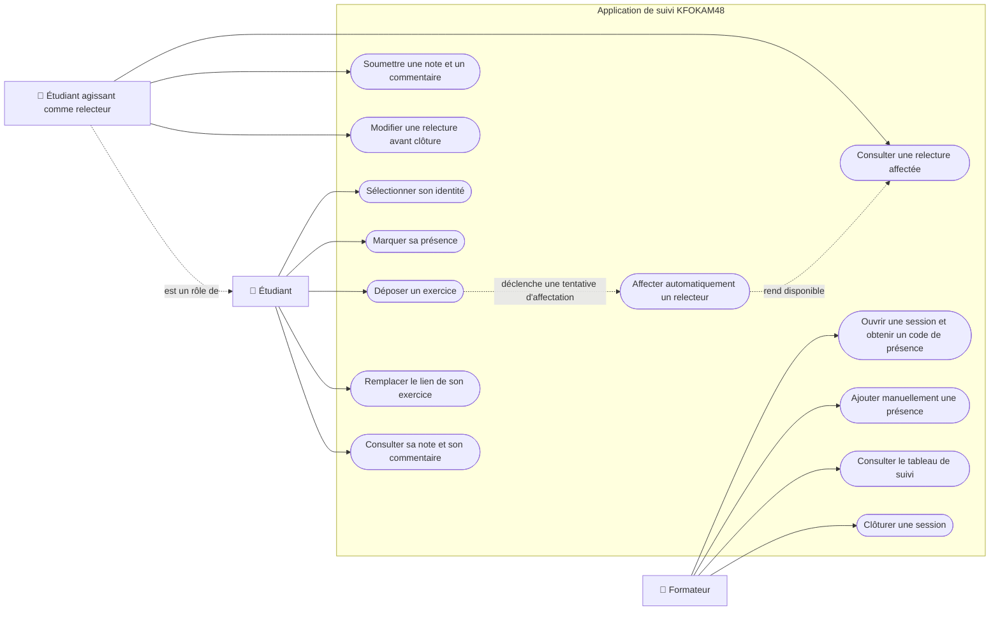

# D1 — Diagramme de cas d'utilisation

Ce diagramme présente les acteurs de l'application KFOKAM48 et les principales actions qu'ils peuvent réaliser.

## Contraintes principales

- Le code de présence expire 15 minutes après l'ouverture de la session.
- Un étudiant ne peut être présent qu'une seule fois à une même session.
- Après cinq codes incorrects, l'étudiant est bloqué pendant deux minutes.
- Un étudiant ne peut jamais relire son propre exercice.
- Un exercice ne possède qu'un seul relecteur.
- Le relecteur est choisi automatiquement parmi les étudiants présents.
- Une note doit être un entier compris entre 0 et 20.
- Le nom du relecteur n'est pas communiqué à l'étudiant relu.
- Le lien d'un exercice ne peut être remplacé que tant que sa relecture n'a pas commencé.
- Une relecture peut être modifiée tant que la session n'est pas clôturée, conformément à la décision retenue pour la contradiction Q10/Q15.