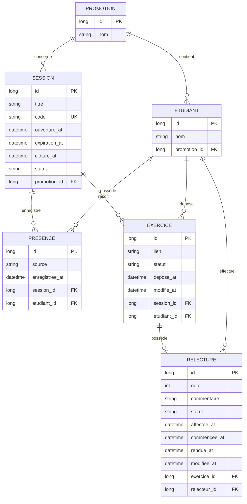

# D2 — Modèle de données

Ce diagramme présente les principales entités nécessaires au fonctionnement de l'application, leurs attributs essentiels et leurs relations.

## Description des entités

### Promotion

Une promotion regroupe plusieurs étudiants et plusieurs sessions de formation.

Attributs principaux :

- `id` : identifiant de la promotion ;
- `nom` : nom ou libellé de la promotion.

### Étudiant

Un étudiant appartient à une promotion.

Il peut :

- marquer sa présence ;
- déposer des exercices ;
- être désigné comme relecteur.

Attributs principaux :

- `id` : identifiant de l'étudiant ;
- `nom` : nom de l'étudiant ;
- `promotion_id` : promotion à laquelle il appartient.

### Session

Une session représente une session de cours ouverte par le formateur.

Attributs principaux :

- `id` : identifiant de la session ;
- `titre` : titre de la session ;
- `code` : code utilisé pour marquer la présence ;
- `ouverture_at` : date et heure d'ouverture ;
- `expiration_at` : date et heure d'expiration du code ;
- `cloture_at` : date et heure de clôture, si la session est clôturée ;
- `statut` : état courant de la session ;
- `promotion_id` : promotion concernée.

Le code expire 15 minutes après l'ouverture conformément à RG2.

### Présence

Une présence relie un étudiant à une session.

Attributs principaux :

- `id` : identifiant de la présence ;
- `source` : origine de la présence ;
- `enregistree_at` : date et heure d'enregistrement ;
- `session_id` : session concernée ;
- `etudiant_id` : étudiant concerné.

La valeur de `source` est :

- `ETUDIANT` lorsque l'étudiant utilise lui-même le code ;
- `FORMATEUR` lorsque la présence est ajoutée manuellement.

Un étudiant ne peut avoir qu'une seule présence pour une même session.

Une contrainte d'unicité devra donc être définie sur :

`(session_id, etudiant_id)`.

### Exercice

Un exercice représente le lien déposé par un étudiant pour une session.

Attributs principaux :

- `id` : identifiant de l'exercice ;
- `lien` : URL de l'exercice ;
- `statut` : état courant de l'exercice ;
- `depose_at` : date et heure du premier dépôt ;
- `modifie_at` : date et heure de dernière modification ;
- `session_id` : session concernée ;
- `etudiant_id` : auteur de l'exercice.

Un étudiant ne peut déposer qu'un seul exercice par session.

Une contrainte d'unicité devra donc être définie sur :

`(session_id, etudiant_id)`.

### Relecture

Une relecture correspond à l'affectation d'un exercice à un autre étudiant.

Attributs principaux :

- `id` : identifiant de la relecture ;
- `note` : note entière comprise entre 0 et 20 ;
- `commentaire` : commentaire du relecteur ;
- `statut` : état courant de la relecture ;
- `affectee_at` : date d'affectation ;
- `commencee_at` : date à laquelle la relecture est considérée comme commencée ;
- `rendue_at` : date de soumission ;
- `modifiee_at` : date de dernière modification ;
- `exercice_id` : exercice relu ;
- `relecteur_id` : étudiant chargé de la relecture.

Un exercice possède au maximum une relecture.

Le relecteur doit être un étudiant présent à la session et ne doit jamais être l'auteur de l'exercice.

La note doit être un entier compris entre 0 et 20 inclus.

## Contraintes d'intégrité importantes

Les contraintes suivantes devront être respectées dans la base de données ou dans la couche métier :

1. unicité de la présence pour le couple `(session_id, etudiant_id)` ;
2. unicité de l'exercice pour le couple `(session_id, etudiant_id)` ;
3. unicité de la relecture pour un exercice ;
4. impossibilité pour un étudiant de relire son propre exercice ;
5. note comprise entre 0 et 20 et entière ;
6. `source` d'une présence limitée à `ETUDIANT` ou `FORMATEUR` ;
7. le relecteur doit appartenir aux étudiants présents à la session concernée ;
8. le code de présence doit être unique parmi les sessions actives.

## Remarque sur les tentatives de code incorrectes

La règle RG4 impose un blocage de deux minutes après cinq codes de présence incorrects.

Le besoin ne précise pas si cet état doit être conservé durablement en base de données.

Dans la première conception, cette information est considérée comme un état technique temporaire géré par le service de présence. Si la persistance de cet état s'avère nécessaire lors de l'implémentation, une migration dédiée sera ajoutée et ce diagramme sera mis à jour avant le jalon concerné.