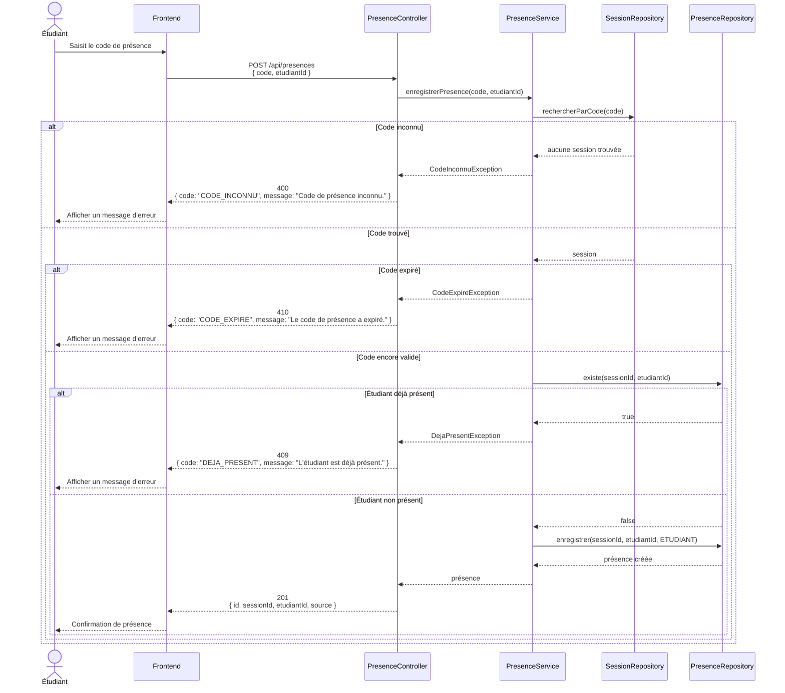

# D3 — Diagramme de séquence : marquer sa présence

Ce diagramme décrit le scénario de marquage de présence d'un étudiant à une session.

Il présente :

- le cas nominal ;
- le cas d'un code inconnu ;
- le cas d'un code expiré ;
- le cas d'un étudiant déjà présent.



## Cas nominal

L'étudiant saisit un code de présence valide.

Le frontend envoie :

```http
POST /api/presences
```

avec :

```json
{
  "code": "CODE_SESSION",
  "etudiantId": 1
}
```

Le backend vérifie :

1. que le code correspond à une session ;
2. que le code n'est pas expiré ;
3. que l'étudiant n'est pas déjà présent.

Si toutes les conditions sont satisfaites, la présence est créée avec la source :

```text
ETUDIANT
```

La réponse HTTP est :

```http
201 Created
```

avec un corps de la forme :

```json
{
  "id": 10,
  "sessionId": 3,
  "etudiantId": 1,
  "source": "ETUDIANT"
}
```

---

## Cas d'erreur — code inconnu

Si aucun code de session ne correspond au code fourni, la présence n'est pas créée.

Réponse :

```http
400 Bad Request
```

Exemple :

```json
{
  "code": "CODE_INCONNU",
  "message": "Code de présence inconnu."
}
```

---

## Cas d'erreur — code expiré

Conformément à RG2, le code expire 15 minutes après l'ouverture de la session.

Si l'étudiant tente d'utiliser un code expiré, la présence n'est pas créée.

Réponse :

```http
410 Gone
```

Exemple :

```json
{
  "code": "CODE_EXPIRE",
  "message": "Le code de présence a expiré."
}
```

---

## Cas d'erreur — étudiant déjà présent

Conformément à RG16, un étudiant ne peut avoir qu'une seule présence pour une même session.

Si une présence existe déjà pour le couple :

```text
(session_id, etudiant_id)
```

la création est refusée.

Réponse :

```http
409 Conflict
```

Exemple :

```json
{
  "code": "DEJA_PRESENT",
  "message": "L'étudiant est déjà présent."
}
```

---

## Règles de gestion concernées

- **RG2** : le code de présence expire 15 minutes après l'ouverture de la session.
- **RG3** : la présence ne peut pas être enregistrée hors de la période autorisée.
- **RG4** : après cinq codes incorrects, l'étudiant est bloqué pendant deux minutes.
- **RG15** : la source d'une présence vaut `ETUDIANT` ou `FORMATEUR`.
- **RG16** : un étudiant ne peut être présent qu'une seule fois à une même session.

## Remarque concernant RG4

La règle de blocage après cinq codes incorrects existe dans le besoin client, mais le contrat API fourni ne définit pas explicitement un code HTTP spécifique pour ce blocage.

Ce comportement sera donc traité lors de la conception détaillée de l'API sans modifier les codes HTTP imposés pour les cas déjà définis par le contrat.