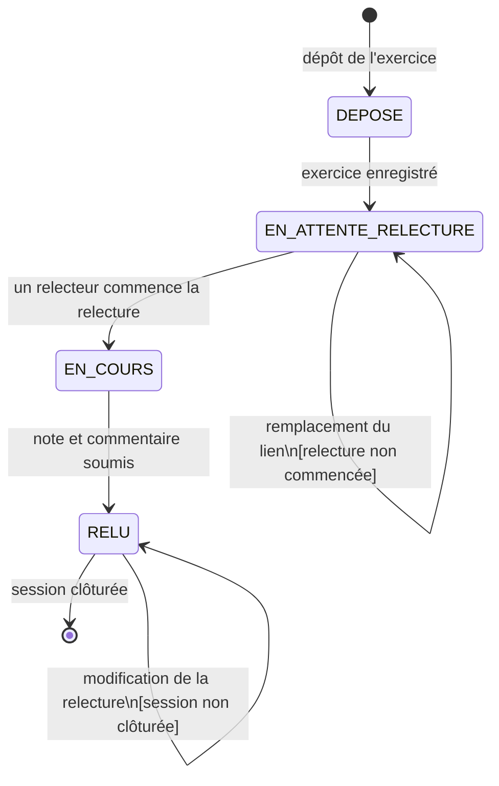

# D4 — Diagramme états-transitions du cycle de vie d'un exercice

Ce diagramme présente le cycle de vie d'un exercice depuis son dépôt par un étudiant jusqu'à sa relecture.

## Description des états

### `DEPOSE`

L'exercice vient d'être enregistré par l'étudiant.

Il contient notamment :

- l'étudiant auteur ;
- la session concernée ;
- le lien de l'exercice ;
- la date de dépôt.

Après son enregistrement, l'exercice passe dans l'état `EN_ATTENTE_RELECTURE`.

---

### `EN_ATTENTE_RELECTURE`

L'exercice a été déposé mais sa relecture n'est pas encore commencée.

Tant que l'exercice est dans cet état, son auteur peut remplacer le lien de son exercice conformément à RG13.

Le système doit tenter d'affecter un relecteur parmi les étudiants présents à la session.

Le relecteur :

- ne peut pas être l'auteur de l'exercice ;
- doit faire partie des étudiants présents ;
- est unique pour l'exercice.

Si aucun étudiant admissible n'est disponible, l'exercice reste en attente.

---

### `EN_COURS`

Une relecture a commencé.

À partir de cet état, le lien de l'exercice ne peut plus être remplacé.

Le relecteur peut préparer :

- une note entière comprise entre 0 et 20 ;
- un commentaire.

---

### `RELU`

La relecture a été soumise.

L'auteur de l'exercice peut consulter :

- la note obtenue ;
- le commentaire.

L'identité du relecteur ne lui est pas communiquée.

Conformément à la décision prise pour la contradiction Q10/Q15, le relecteur peut encore modifier sa relecture tant que la session n'est pas clôturée.

Une fois la session clôturée, aucune nouvelle modification de la relecture n'est autorisée.

---

## Transitions

| État initial | Événement | Condition | État obtenu |
|---|---|---|---|
| Aucun | Dépôt d'un exercice | Lien valide et aucun exercice déjà déposé par cet étudiant pour la session | `DEPOSE` |
| `DEPOSE` | Enregistrement terminé | — | `EN_ATTENTE_RELECTURE` |
| `EN_ATTENTE_RELECTURE` | Remplacement du lien | La relecture n'a pas commencé | `EN_ATTENTE_RELECTURE` |
| `EN_ATTENTE_RELECTURE` | Début de la relecture | Un relecteur valide est affecté et commence la relecture | `EN_COURS` |
| `EN_COURS` | Soumission de la relecture | Note entière entre 0 et 20 et commentaire renseigné | `RELU` |
| `RELU` | Modification de la relecture | Session non clôturée | `RELU` |
| `RELU` | Clôture de la session | — | État final |

## Règles de gestion concernées

- **RG5** : un étudiant ne peut jamais relire son propre exercice.
- **RG6** : un exercice ne possède qu'un seul relecteur.
- **RG7** : le relecteur est choisi parmi les étudiants présents.
- **RG8** : l'identité du relecteur n'est pas communiquée à l'étudiant relu.
- **RG9** : la note est un entier compris entre 0 et 20.
- **RG10** : la relecture peut être modifiée tant que la session n'est pas clôturée, selon la décision retenue pour Q10/Q15.
- **RG11** : une relecture non rendue reste en attente.
- **RG13** : le lien de l'exercice peut être remplacé tant que la relecture n'a pas commencé.